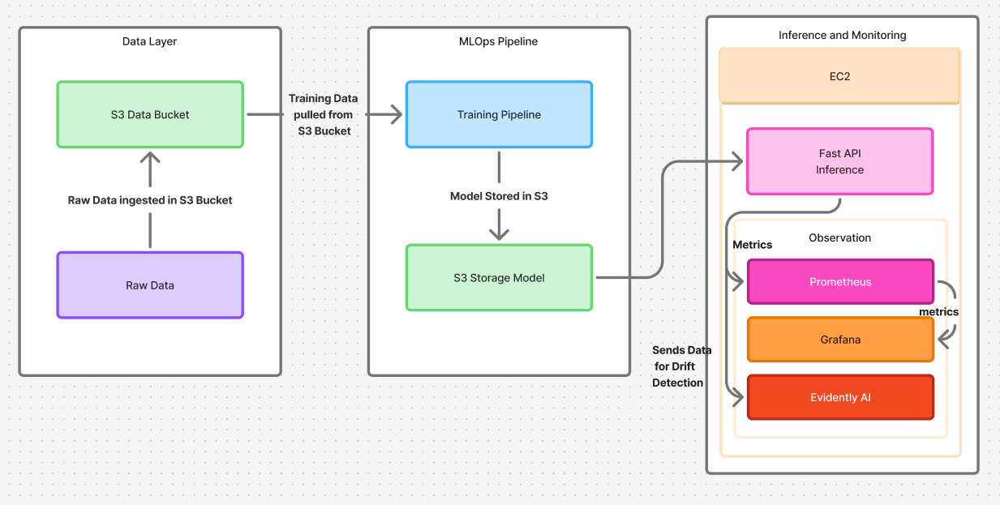
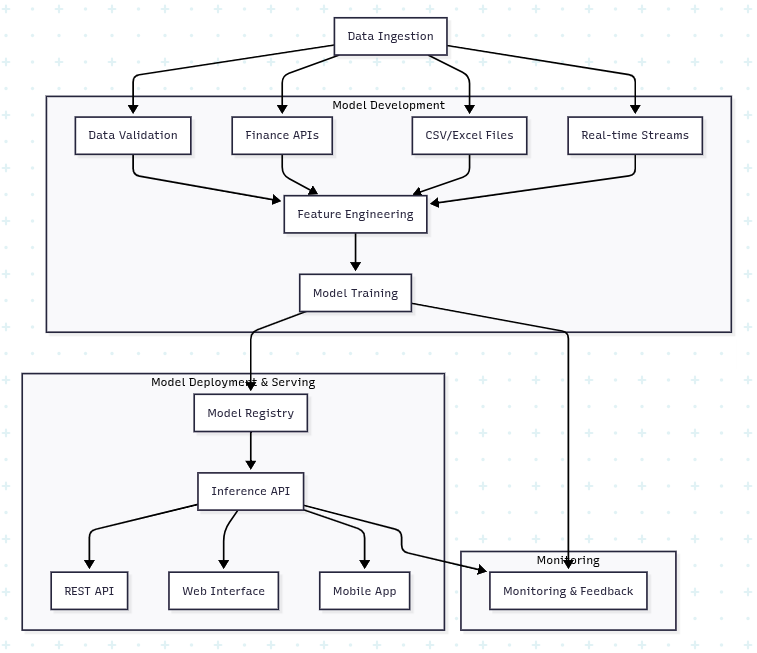

MLOps — Finance Assistant

🚀 One-line Elevator Pitch

Operational MLOps pipeline for financial predictions with FastAPI serving, S3-backed artifacts, and observability via Prometheus + Grafana.

🏗️ Architecture Diagram




⚡ Quick Start

- Clone and prepare dev environment:

```bash
git clone https://github.com/AliJack20/MLOps--Finance-Assistant.git
cd MLOps--Finance-Assistant
make dev

mlflow ui --backend-store-uri file:./mlruns
python src/train.py

```

- Add the .env and MLOps Pair.prem files to root directory (for S3 access during serving and MLflow if used):

Run mlflow ui --backend-store-uri file:./mlruns to start mlflow locally.

Run python src/train.py for the entire flow including pulling data from S3, training model, getting metrics, storing metric in mlfow, storing model in S3, starting EC2 and Docker, pulling model from S3 for prediction and inference/monitoring(Evidently,Grafana, Prometheus).

```bash
AWS_ACCESS_KEY_ID=YOUR_KEY
AWS_SECRET_ACCESS_KEY=YOUR_SECRET
AWS_REGION=ap-south-1
S3_BUCKET=mlops-financeai-s3-bucket
```

- Run locally (Docker Compose):

```bash
docker-compose up -d --build
# API:        http://localhost:8000/docs
# Metrics:    http://localhost:8000/metrics
# Prometheus: http://localhost:9090
# Grafana:    http://localhost:3000  (admin/admin)
```

🛠️ Make Targets

Backed by the repo’s `Makefile`:

- `make dev`: install deps and pre-commit
- `make lint`: Black check + Ruff
- `make format`: Black + Ruff --fix
- `make test`: run pytest with coverage
- `make docker-build`: build API image
- `make docker-run`: run API container (port 8000)
- `make docker-stop`: stop/remove API container
- `make push-ecr`: build, tag and push image to AWS ECR
- `make deploy-ec2`: pull from ECR and run on EC2 (port 80)
- `make clean`: remove caches and temp files

Notes:
- Set `ACCOUNT_ID` and `EC2_IP` in `Makefile` for ECR/EC2 flows.
- Ensure your EC2 has a `/home/ec2-user/.env` with the same variables as above for `deploy-ec2`.

📊 Monitoring

- Prometheus is configured at `monitoring/prometheus.yml` to scrape the app:
  - Job: `inference_api` → target `inference_api:8000`
- The FastAPI app exposes metrics via `prometheus-fastapi-instrumentator` and the `/metrics` endpoint.
- Grafana runs with persistence under `monitoring/grafana` and can be provisioned to use Prometheus.

❓ FAQ

- Why is Grafana empty/no data?
  - Generate traffic: send a few requests to `/predict` from `http://localhost:8000/docs`.
  - Wait 10–30s for Prometheus to scrape.
  - Refresh the Grafana panel.

- Docker permission issues (Grafana data)?
  - Ensure host dir is writable: `sudo chmod -R 777 ./monitoring/grafana` (local-only convenience).
  - Add `monitoring/grafana/` to `.gitignore` to avoid committing runtime data.

- Tests or app fail due to missing env vars?
  - Set `AWS_ACCESS_KEY_ID`, `AWS_SECRET_ACCESS_KEY`, `AWS_REGION`, `S3_BUCKET` in your shell or `.env`.
  - For unit tests, mock S3/model loading to avoid external calls.

- Windows/Mac setup tips?
  - Use Docker Desktop with WSL2 (Windows) or Docker Desktop (macOS).
  - Run `make dev` in a Python 3.11 environment, or use Dev Containers.
  - If `make` is unavailable on Windows, run the equivalent commands from the Makefile manually.


NOTE: Need MLOps pair.pem key and .env at root directory
